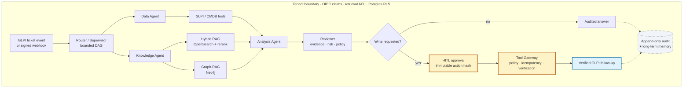
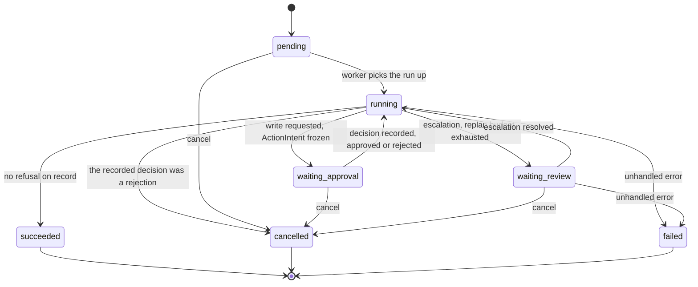

# ⚙️ ServiceMind

[](https://github.com/shark6438/servicemind/actions/workflows/test.yml)
[](https://github.com/shark6438/servicemind/blob/main/pyproject.toml)
[](https://github.com/shark6438/servicemind/blob/main/LICENSE)

> **简体中文说明见 [README.zh-CN.md](README.zh-CN.md)。**

ServiceMind turns a GLPI ticket into a **tenant-scoped, auditable and human-governed ITSM
run**. It is designed for the gap between an LLM that can suggest a response and an ITSM
platform that must explain its evidence, respect access boundaries and require approval
before changing a production ticket.

[Quickstart](#quickstart) · [Architecture](#architecture) · [Evaluation](#evaluation-snapshot) · [Usage](#usage-walkthrough)

## The product flow

Every stage below runs inside one tenant boundary. Reading is filtered on the way out;
writing is refused until a human resolves a frozen action.



Read access is constrained by OIDC claims, retrieval ACLs and PostgreSQL row-level security;
a write is bound to a reviewed `ActionIntent` and is verified against GLPI after it is made.

## Core capabilities

| Capability | What it provides |
| --- | --- |
| **Governed multi-agent orchestration** | A LangGraph Router/Supervisor plans and dispatches Data, Knowledge, Analysis, Reviewer and Action tasks as a bounded DAG. |
| **Enterprise evidence retrieval** | Hybrid OpenSearch retrieval, reranking, citations and optional Neo4j Graph-RAG, all filtered by tenant/entity/group ACLs. |
| **Human-controlled change execution** | Immutable action hashes, reviewer gates, HITL approval, idempotency, read-after-write verification and append-only audit records. |
| **Model and tool governance** | Provider/model allowlists, cost and timeout limits, semantic caching, a schema-validated Tool Gateway, OPA support and MCP exposure. |
| **Operational console** | OIDC-protected Next.js and Streamlit interfaces for runs, approvals, audit, memory review and evaluation visibility. |

## Evaluation snapshot

The evaluation records are versioned evidence, not marketing claims. The current delivery
summary and known limitations are in
[the final deliverable report](docs/SERVICEMIND_FINAL_DELIVERABLE_REPORT_2026-10-03.md).
Each live evaluation campaign was checked against one deployed revision within that campaign;
different campaigns are not claimed to share the same source revision.

| Area | Recorded result |
| --- | --- |
| Response quality (frozen suite) | **119/120 answerable cases (99.17%)** passed the reviewer-decision gate; all 80 negative-control cases passed. This is not an answer-accuracy or production-success rate. |
| Security and fault handling | **72 scenarios passed**; 252 evidence assertions and 87 mutation assertions passed |
| Reliability | Run status and review decision were stable across 8 cases × 5 repeats; citation output remains flaky (`0.875`) |
| Load | **Not accepted**: the gate fails on deterministic case `Q-002`; latency itself did not regress |
| RAG retrieval quality | **Not certified**: gold-label defects, proxy-corpus mismatch and metric/cutoff issues prevent publishing Recall/MRR/NDCG as performance claims; diagnosis also found four genuine retrieval misses. |
| Memory | Governance contracts pass; production business quality has not been sampled |

Detailed evidence, including the non-passing gates, is linked from
[the 18-area coverage audit](docs/EVALUATION_18_COVERAGE_AUDIT_2026-10-02.md). See
[evaluation/README.md](evaluation/README.md) for the evidence taxonomy and retention policy.
Historical artifacts under `evaluation/` are intentionally retained so the recorded conclusions
can be traced to their inputs.

## Architecture

ServiceMind is layered, and no layer re-derives authority: intake, orchestration, evidence,
governance and execution, and the storage/integration edge all inherit the same tenant
boundary. The **read path** and the **write path** are separate paths with separate gates —
reads are filtered on the way out, writes are refused until a human resolves a frozen
`ActionIntent`, and both land in the same append-only ledger.


The intake and GLPI action labels in this overview are conceptual: this repository ships
GLPI/webhook/API/console intake and an approval-gated **ticket follow-up** write. Email and
Teams/Slack intake, and general ticket create/update/resolve actions, are not shipped
connectors or write capabilities.

### Tenant and permission model

Authority enters the system exactly once — as OIDC token claims — and is enforced at four
independent points rather than trusted downstream.

| Enforcement point | The rule |
| --- | --- |
| PostgreSQL row-level security | Every product table is read and written under a `set_config`-pinned tenant session. |
| Retrieval ACL | A document (and a projected graph node) declaring no entity/group restriction is visible tenant-wide; one that declares a restriction requires an intersection with the principal. |
| Memory ACL | A record's declared `required_entity_ids` / `required_group_ids` must be a **subset** of the principal's, so a narrower principal sees strictly fewer records — never more. |
| Tool registry | A role intersection is mandatory. An entity-scoped tool additionally requires an entity intersection. |

The graph side channel is not exempt: projected `GraphNode`s carry the same ACL coordinates
and delegate to the same rule, so the boundary is written once and cannot drift between the
document path and the graph path.


Long-term memory and its review queue are persisted in PostgreSQL. The illustration's
policy snippets are schematic: PostgreSQL RLS enforces the tenant boundary; role checks
are handled by the service, while retrieval and memory additionally enforce their own
entity/group ACLs. The table above and the implementation are authoritative.

### Run lifecycle

A run is a durable state machine, not a request. The statuses below are what
`GET /v1/servicemind/runs/{id}` returns.



Two properties are worth reading off that diagram. A rejection ends the run: recording the
decision returns it to `running` only so the graph can unwind, and it finalizes as
`cancelled` without executing anything — refusing is never blocked by a missing approval
path. And `waiting_approval` is a **hold**, not a queue: nothing reaches GLPI while a run
sits there, and the decision is bound to the frozen `ActionIntent` hash rather than to
whatever the action has become since.

## Repository layout

Product and scaffold live under one `src/` tree. The **product** is self-contained in
`src/servicemind/` and is mounted onto the service in `src/service/service.py`.

```text
src/
├── servicemind/        # Packaged modular product
│   ├── foundation/     # Framework-independent primitives shared across contexts
│   ├── domain/         # Pure business contracts and integrity primitives
│   ├── orchestration/  # Durable workflows, planning, recovery, governance
│   ├── interfaces/http/# Inbound HTTP adapters
│   ├── persistence/    # Database and transactional-outbox adapters
│   └── rag|memory|context|model_gateway|tool_platform|…
├── service/            # FastAPI composition root (`create_app`)
├── agents/             # Inherited LangGraph agents (chatbot, research-assistant, …)
├── core/               # Settings + model lookup (shared)
├── schema/             # Protocol + model-name schema
├── client/             # AgentClient (build other apps on the agent service)
├── voice/              # STT/TTS providers for the chat UI
├── pages/              # Packaged Streamlit review pages
├── streamlit_app.py    # ServiceMind Console (chat UI)
└── run_service.py      # Entry point: uvicorn "service:app"
migrations/             # Alembic migrations 0001–0013 (product schema, Postgres)
deploy/glpi/            # Local GLPI + MariaDB + Postgres + Keycloak + OpenSearch +
                        #   Neo4j + TEI embedding/reranker + Redis + OPA stack (compose)
evaluation/             # Gold sets, retrieval/route/acceptance eval harness + reports
skills/                 # Versioned skills the agents can be equipped with
docker/                 # Dockerfiles (service / app), add-on compose files
docs/                   # Phase acceptance docs + the enterprise spec
scripts/                # Phase seed / verify / ingest / evaluate scripts
deploy/systemd/         # Versioned API / frontend / Streamlit / outbox process manifests
frontend/               # Next.js 16 operator console (OIDC, tenant-scoped API views)
```

The service boot path (`src/service/service.py` → `src/run_service.py`) and the root
`compose.yaml` still depend on the inherited scaffold layers (`src/agents|core|memory|
schema|client|voice` + `streamlit_app.py`), so those layers are load-bearing and not
"product" code — treat them as runtime infrastructure.

`pyproject.toml` defines the build backend, explicit package discovery and installed
`servicemind-api` / `servicemind-outbox` entry points.
[`scripts/audit_project_structure.py`](scripts/audit_project_structure.py) is the executable
architecture contract, run by CI's `architecture-gate` job: it rejects package cycles,
outward domain imports, source-tree path injection, incomplete process manifests, and any
growth of the product's imports from the inherited scaffold. The scaffold budget is frozen
debt — `core` at 26 import sites, `schema` at 1 — and may only shrink. The gate also fails
when the committed report stops matching the tree, so the evidence cannot drift away from
what it describes. Machine-readable results land in
`evaluation/reports/project_structure_latest.{json,md}`. See
[`docs/PROJECT_STRUCTURE_ENTERPRISE_AUDIT_2026-09-22.md`](docs/PROJECT_STRUCTURE_ENTERPRISE_AUDIT_2026-09-22.md).

## Runtime topology

A GLPI ticket event (or a `runs` request) enters the **service shell**; the ServiceMind
**orchestration runtime** plans the run as a multi-step LangGraph graph. Retrieval layers
feed the planner: **hybrid RAG** (OpenSearch + rerank, gated by tenant RLS + ACLs) and
**Graph-RAG** (Neo4j, optional). Writes go back through **GLPI** only after an approver
resolves the pending action. Every step transacts against **Postgres** under
`set_config`-pinned tenant sessions, is recorded to the **append-only audit**, and the
model calls go through the **model gateway** (allowlists, cost ceilings, audit). See
[`docs/PHASE5_FINAL_ARCHITECTURE_AND_ACCEPTANCE.md`](docs/PHASE5_FINAL_ARCHITECTURE_AND_ACCEPTANCE.md)
and [`docs/企业IT服务管理(ITSM)智能体平台.md`](docs/企业IT服务管理(ITSM)智能体平台.md).


Ports in this diagram are local stack defaults. The systemd deployment in
[LOCAL_DEPLOYMENT.md](LOCAL_DEPLOYMENT.md) binds the API to `127.0.0.1:18080` instead of
`:8080`; OpenSearch, Neo4j and TEI require the Compose `rag` profile. The Teams/Slack
intake and general GLPI create/update labels are conceptual, not shipped capabilities:
the implemented intake is GLPI webhook/API/console, and the governed write is a ticket
follow-up after approval.

## Quickstart

### Prerequisites

- Python ≥ 3.12, < 3.15, and [uv](https://docs.astral.sh/uv/) (this repo pins uv in CI and
  in the Dockerfiles; see [DEPENDENCIES.md](DEPENDENCIES.md)).
- At least one LLM provider key in `.env` (DeepSeek is the ServiceMind default; the
  toolkit's OpenAI/Anthropic/etc. providers remain available). `USE_FAKE_MODEL=true`
  removes that requirement for a zero-external demo.

### A. Core stack with Docker Compose

The root [compose.yaml](compose.yaml) starts Postgres, the agent service, and the
Streamlit app:

```sh
cp .env.example .env        # then add a provider API key and SERVICEMIND_DATABASE_URL
docker compose watch        # or: docker compose up --build
```

- ServiceMind Console: <http://localhost:8501>
- Agent service + OpenAPI docs: <http://localhost:8080/redoc>

### B. Enterprise GLPI stack (recommended for ITSM features)

The ServiceMind API needs Postgres 16, and full incident workflows need GLPI + Keycloak +
OpenSearch + Neo4j + TEI. The Phase 6 tool platform additionally needs Redis (rate limiting,
bulkhead, circuit-breaker and task state) and optionally OPA for external policy decisions.
`deploy/glpi/compose.yaml` defines these infrastructure dependencies; OpenSearch, Neo4j
and TEI require its `rag` profile. It does **not** start the ServiceMind API or operator
console. Start those separately after the dependencies are ready; see
[deploy/glpi/README.md](deploy/glpi/README.md) for commands and ports.

### C. Manual run without Docker

```sh
uv sync --frozen

# .env: set a provider key + SERVICEMIND_DATABASE_URL (Postgres recommended).
# For a UI-only demo with no LLM key and no infra:
#   USE_FAKE_MODEL=true
#   SERVICEMIND_DATABASE_URL=sqlite+aiosqlite:///./servicemind.db
cp .env.example .env

# For ITSM endpoints with PostgreSQL, create/extend the product schema.
# Skip this step for the SQLite UI-only shell demo:
uv run alembic upgrade head

# Shell 1 — agent service
uv run servicemind-api

# Shell 2 — ServiceMind Console
uv run streamlit run src/streamlit_app.py
```

### D. Operator console (Next.js 16)

`frontend/` is the operator-facing console (workbench / runs / approvals / memory review /
audit / quality and release). It authenticates through Keycloak OIDC and attaches the user
token to every request; tenant, role, entity, group, approval, memory-policy and
exact-snapshot decisions always stay with the backend. The console has **no direct GLPI
write path** — it can only start a governed run and decide already-frozen actions.

```sh
cd frontend
docker build -t servicemind-frontend:local .
systemctl --user enable --now servicemind-frontend.service   # unit in deploy/systemd/
```

It listens on <http://127.0.0.1:3000>. Node.js 24 is required; development and gate
commands live in [frontend/README.md](frontend/README.md).

## Usage walkthrough

The console trims its navigation by role. **The navigation is only a visibility hint — the
real decision point is the server-side `require_role` dependency**, so a hand-crafted
request from the wrong role is still rejected with 403.

| Account | Roles | Visible navigation |
| --- | --- | --- |
| `acme-analyst` | `viewer`, `analyst` | Workbench, Runs, Quality and release |
| `acme-approver` | `viewer`, `analyst`, `operator`, `approver` | Everything (plus Approvals, Memory review, Audit) |


Real browser capture of a completed read-only run, signed in as `acme-analyst`. Identifiers and
evidence bodies were redacted in the browser before capture; nonessential panels were hidden to
fit the task plan, evidence and reviewer verdict in one frame. No approval action is visible.

> **Data prerequisite — read this first.** `POST /v1/servicemind/runs` requires
> `ticket_id ≥ 1`, and every run's first task is `get_ticket`. **If the referenced ticket
> does not exist in GLPI**, GLPI answers 404, the tool gateway records that as
> `provider_not_found` (mapping in
> [src/servicemind/tool_platform/gateway.py](src/servicemind/tool_platform/gateway.py)),
> T1 fails, the Supervisor replans twice without progress and the run ends as
> `waiting_review` escalated to a human. That is missing data, not a product defect —
> create the ticket in GLPI before starting the run.
>
> To get a workable corpus in one step, seed the demo tickets (idempotent — it never
> rewrites an existing ticket's fields, only fills in a missing followup timeline):
>
> ```bash
> uv run python scripts/seed_demo_glpi_tickets.py            # add --dry-run to preview
> ```
>
> It writes 23 tickets through the same tenant integration the product uses, so the
> entity and profile match production exactly. Verified against the local stack: first
> run reports `已创建: 8 条；已存在跳过: 15 条` plus the timelines it backfilled, a second
> run reports `已创建: 0 条；已存在跳过: 23 条`.
>
> **What a run does with this corpus** (measured, not projected): tickets whose recorded
> facts and followup timeline support the analysis end `succeeded` with
> `review.decision = passed`; tickets the policy classifies as major-priority
> (e.g. urgency 5 / impact 4 → priority 5) end `waiting_review` with
> `HUMAN_REVIEW_REQUIRED` — the deterministic gate stops them before the semantic judge
> is even consulted; and a request for a root cause the evidence cannot support ends
> `passed` with the gap written into `unresolved_questions` instead of a fabricated
> hypothesis. A run started with the write flag ends `waiting_approval` on a frozen
> `action_intent`, and nothing reaches GLPI until an approver decides.

### Case 1 — read-only incident investigation (analyst)

1. Open <http://127.0.0.1:3000>, click "使用企业身份登录" and sign in to Keycloak as
   `acme-analyst`.
2. In the workbench's "向运维智能体提问" form, describe the problem, put a **ticket that
   actually exists** in "关联 GLPI 工单", leave "允许生成写操作建议" **unchecked**, and
   press "发送给智能体" (or Ctrl / ⌘ + Enter).
3. The browser lands on `/runs/{id}`, showing the Supervisor's task DAG — T1 `get_ticket`
   (ticket context), T2 `knowledge` (RAG / Graph-RAG retrieval), T3 `analysis`,
   T4 `reviewer` — together with the evidence references and the review verdict.
4. `acme-analyst` is read-only, so **not seeing an approve button is expected**.

### Case 2 — write-action proposal and human approval (analyst files, approver decides)

1. Start the run as `acme-analyst` with "允许生成写操作建议" **checked**.
2. Once policy checks pass, the run freezes an `action_intent` carrying the action type,
   target, arguments, risk level, action hash, intent version, policy version, review
   digest, evidence digest, evidence refs and expiry; the status becomes `waiting_approval`.
3. Sign in as `acme-approver`, open "审批中心", check the frozen intent against the
   evidence it cites, then approve or reject.
4. **Both outcomes are written to `audit_events`**, the governance ledger, and are
   traceable from the "审计记录" page.

### Case 3 — handling a review escalation

When a prerequisite task fails, the Reviewer demands a revised plan and the replan budget
is exhausted, the run ends as `waiting_review` and the timeline states the reason (for
example, "T1 failed twice, the incident context was never established, no safe analytical
progress is possible"). An `acme-approver` resolves it through review-resolution on the
run detail page.

### Case 4 — long-term memory review (approver)

"记忆复核" lists quarantined long-term memory snapshots for individual activation or
rejection. The decision binds to an **exact snapshot** (version plus content digest)
rather than a fuzzy match, so reviewed content cannot be silently replaced by a later
write.

### Case 5 — audit traceability

"审计记录" is a **read-only, append-only** governance ledger, and it is **a different
ledger from the run timeline**:

- `run_events` (run timeline) — what happened inside a run: routing, planning, dispatch,
  agent completion, escalation.
- `audit_events` (governance ledger) — governance actions: run creation, approval,
  cancellation.

Visible to `operator` / `approver` / `tenant_admin`.

### Case 6 — quality and release

"质量与发布" renders the repository's accepted machine-report snapshot
(`frontend/public/release-status.json`). It is a **frozen, sanitized** artifact that does
not claim real-time telemetry, and it keeps surfacing the "领域质量尚未认证" exception
until tenant-domain evidence closes it.

## Configuration

Everything is environment-driven through [`.env.example`](.env.example). Main groups:

- **Providers** — `DEEPSEEK_API_KEY` (default provider), plus the toolkit's
  OpenAI/Anthropic/Google/Groq/AWS/Ollama/OpenRouter/compatible keys.
- **Runtime** — `HOST`, `PORT`, `AUTH_SECRET` (HTTP bearer), `MODE=dev` (uvicorn reload),
  `DATABASE_TYPE`/`POSTGRES_*` for the scaffold checkpointer.
- **ServiceMind database** — `SERVICEMIND_DATABASE_URL` (runtime, RLS-tenant-scoped) and
  `SERVICEMIND_MIGRATION_DATABASE_URL` (alembic). Postgres 16 is required for the ITSM
  endpoints; sqlite boots the shell for the UI demo only.
- **GLPI** — `GLPI_BASE_URL`, `GLPI_API_VERSION`, credentials, entity/profile defaults.
- **Phase 4 RAG / Graph-RAG** — OpenSearch URL + credentials, embedding/reranker model +
  pinned revisions, TEI endpoints, RAG feature gates, Neo4j URI/credentials.
- **Phase 5 governance** — `SERVICEMIND_{MEMORY,CONTEXT,SKILLS,MODEL_GATEWAY_AUDIT,
  SEMANTIC_CACHE}_ENABLED` feature gates, model allowlists, cost/time ceilings.

Feature gates are off by default; read the Phase 4/5 docs before enabling them in a
target environment.

## HTTP API reference

| Endpoint | Purpose |
| --- | --- |
| `GET /health`, `GET /info` | Liveness; available agents/models |
| `POST /{agent_id}/invoke`, `/stream` | Generic toolkit agents (inherited) |
| `GET/POST /threads`, `POST /history`, `POST /feedback` | Conversation state + feedback |
| `POST /v1/servicemind/runs` | Start a governed GLPI ticket run (role `analyst`) |
| `GET /v1/servicemind/runs/{id}` | Run state + pending action intent |
| `POST /v1/servicemind/runs/{id}/approval` | Approve/reject a write action (role `approver`) |
| `POST /v1/servicemind/runs/{id}/review-resolution` | Resolve a review escalation |
| `GET /v1/servicemind/memories/review-queue` | List/filter ACL-scoped quarantined memories (`approver`) |
| `POST /v1/servicemind/memories/{id}/review` | Activate/reject an exact memory snapshot (`approver`) |
| `POST /v1/servicemind/runs/{id}:cancel` | Cancel a pending/awaiting run |
| `GET /v1/servicemind/runs/{id}/events` | SSE stream of run events |
| `POST /v1/servicemind/webhooks/glpi` | Ingest a signed GLPI webhook (idempotent) |
| `GET /v1/servicemind/glpi/health` | GLPI connectivity/tenant probe |
| AG-UI endpoint | Connect any AG-UI compatible frontend |

## Testing and CI

The test suite is the contract. Keep it green before pushing:

```sh
uv run ruff format --check .
uv run ruff check .
uv run pyrefly check
uv run python scripts/audit_project_structure.py --check   # architecture contract
uv run pytest                                   # full offline suite
uv run pytest tests/integration --run-docker    # docker-gated integration
```

The architecture contract compares the tree against the committed report, so after an
intentional structural change regenerate it first — `uv run python
scripts/audit_project_structure.py` (no `--check`) — and commit both together.

`.github/workflows/test.yml` runs ruff, pyrefly, pytest (Python 3.12/3.13/3.14), markdown
linting, the architecture gate, and a docker-based integration job. For per-commit
authoring conventions see [CLAUDE.md](CLAUDE.md).

The frontend job installs with `npm ci`, runs `npm run check` (lint, type-check, unit tests,
production build) and a dependency gate. That gate lives in
[`frontend/scripts/audit-gate.mjs`](frontend/scripts/audit-gate.mjs) rather than being a bare
`npm audit --audit-level=high`, because one advisory in the lint toolchain has **no released
fix** (upstream `braces` is at its latest version, which is the affected one). The gate still
audits the whole installed tree; only the named advisory is excused, and only until it
expires — the same contract as the root [`.trivyignore.yaml`](.trivyignore.yaml), so an
exception is printed in the log and re-enforced automatically.

### What the Phase-7 acceptance gate does and does not say

`uv run python scripts/check_phase7_gate_reports.py` re-runs the four Phase-7 gates offline
and compares each verdict against the report committed for it. It exits 0 when they agree,
and that exit code is easy to read as "acceptance passes". It is not that.

The default acceptance replays were recorded on 2026-09-30 at
`cf08ac8a7b731054e492ed81ba5f3164dc381863+dirty(26 files)`. Their revision is recorded
in each replay's `environment.deployed_revision`, although it is absent from the report's
per-case rows. A separate [2026-10-03 acceptance batch](evaluation/reports/phase7_acceptance_2026-10-03.md)
contains 28/28 passing cases and 107/107 passing assertions at one deployed revision
(`b385df7c…+patch(fbdbefc59bbc)`); its `--expect-revision` check passed against that
deployment. It does not establish the result for later source revisions.

An offline gate exit code confirms the selected replays' verdict and revision homogeneity.
To check whether they match a particular deployed revision, provide `--expect-revision <rev>`.
Without it, `currency_checked: false`; a later checkout cannot inherit an earlier batch's
acceptance result. The other live gates have the same boundary.

## Documentation index

Start here for the recorded evaluation state and its revision boundaries:

- Final deliverable report (the full execution record; Chinese):
  [`docs/SERVICEMIND_FINAL_DELIVERABLE_REPORT_2026-10-03.md`](docs/SERVICEMIND_FINAL_DELIVERABLE_REPORT_2026-10-03.md)
- Evaluation coverage audit, 18 categories item by item:
  [`docs/EVALUATION_18_COVERAGE_AUDIT_2026-10-02.md`](docs/EVALUATION_18_COVERAGE_AUDIT_2026-10-02.md)
- Historical Phase-7 evaluation completion plan (trajectory, coordination, reliability, semantic judge):
  [`docs/PHASE7_REMAINING_EVALUATION_2026-10-02.md`](docs/PHASE7_REMAINING_EVALUATION_2026-10-02.md)

Reference and background:

- Enterprise spec (Chinese): [`docs/企业IT服务管理(ITSM)智能体平台.md`](docs/企业IT服务管理(ITSM)智能体平台.md)
- Architecture map: [`docs/PHASE3_CURRENT_ARCHITECTURE_MAP.md`](docs/PHASE3_CURRENT_ARCHITECTURE_MAP.md)
- Phase 4 RAG technical baseline: [`docs/PHASE4_RAG_TECHNICAL_BASELINE.md`](docs/PHASE4_RAG_TECHNICAL_BASELINE.md)
- Phase 4 RAG quality root cause: [`docs/PHASE4_RAG_QUALITY_ROOT_CAUSE_2026-09-15.md`](docs/PHASE4_RAG_QUALITY_ROOT_CAUSE_2026-09-15.md)
- Phase 5 architecture & acceptance: [`docs/PHASE5_FINAL_ARCHITECTURE_AND_ACCEPTANCE.md`](docs/PHASE5_FINAL_ARCHITECTURE_AND_ACCEPTANCE.md)
- Phase 5 memory quality evaluation: [`docs/PHASE5_MEMORY_QUALITY_EVALUATION.md`](docs/PHASE5_MEMORY_QUALITY_EVALUATION.md)
- Phase 7 acceptance baseline: [`docs/PHASE7_ACCEPTANCE_BASELINE.md`](docs/PHASE7_ACCEPTANCE_BASELINE.md)
- Phase acceptance reports: `docs/PHASE*_ACCEPTANCE.md`, plus live reports under
  `evaluation/reports/`
- Local deployment notes: [`LOCAL_DEPLOYMENT.md`](LOCAL_DEPLOYMENT.md)
- GLPI stack: [`deploy/glpi/README.md`](deploy/glpi/README.md)
- Dependencies & environment: [`DEPENDENCIES.md`](DEPENDENCIES.md)

`agent_architecture.png`, `agent_architecture.excalidraw` and `agent_diagram.png` are the
**upstream toolkit's** diagrams, kept for provenance and attribution. They describe the
inherited scaffold (a Streamlit chat front end over a LangGraph `model`/`tools` loop) and
**not** ServiceMind's ITSM pipeline — do not present them as this product's architecture.

## Upstream, history and license

This project derives from the 🧰 [AI Agent Service Toolkit](https://github.com/JoshuaC215/agent-service-toolkit)
(`JoshuaC215/agent-service-toolkit`, MIT), a full LangGraph + FastAPI + Streamlit agent
service toolkit by Joshua Carroll and contributors. The relationship is kept honest:

- **Full git history is retained** — the repo is not a squashed rewrite. It begins at the
  upstream lineage (~255 commits by Joshua Carroll and the toolkit's other contributors)
  and continues with the ServiceMind commits by **Shark6438** (product work starting
  upstream of `fe3b2dc`, September 2026). The contribution history on GitHub therefore
  shows both the ServiceMind maintainer and the upstream authors whose code this repo
  started from.
- **LICENSE and copyright are preserved** — [LICENSE](LICENSE) is the upstream MIT
  License, Copyright (c) 2024 Joshua Carroll. ServiceMind's additions are distributed
  under the same license.
- **Scaffold code stays attributed** — the inherited toolkit layers (`src/agents`, `src/
  core`, `src/schema`, `src/client`, `src/voice`, `src/streamlit_app.py`, the docker
  files, and the generic chat endpoints) remain their original authors' work. The
  diagrams under `media/agent_*` belong to the same set.

ServiceMind's own additions (the `src/servicemind` product tree, migrations, GLPI stack,
evaluation harness, skills, and the ServiceMind phase docs) are maintained by
**Shark6438**. Thanks to the upstream toolkit and its authors for the foundation.

## Contributing

PRs welcome. Follow [CLAUDE.md](CLAUDE.md) conventions, keep the test suite green, and
preserve the upstream attribution in anything you touch.
