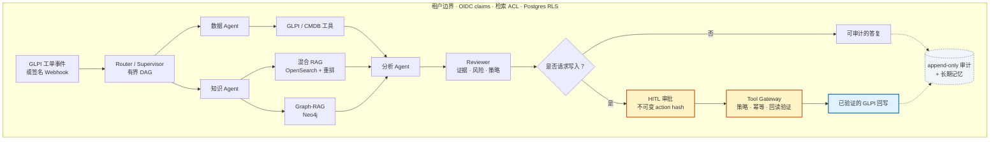
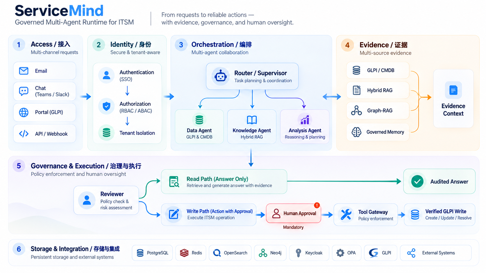
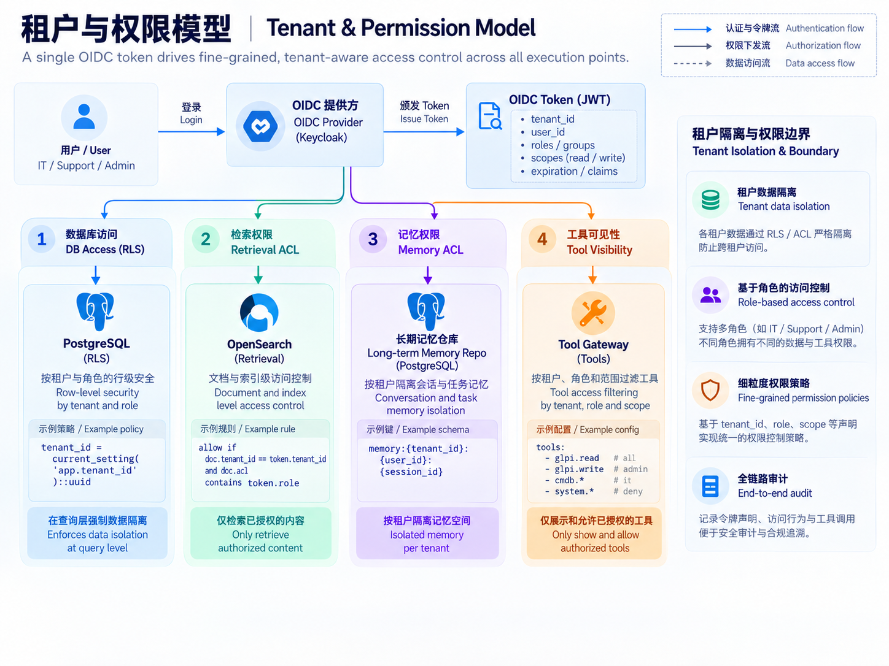
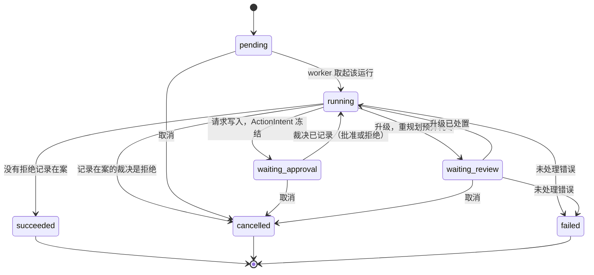
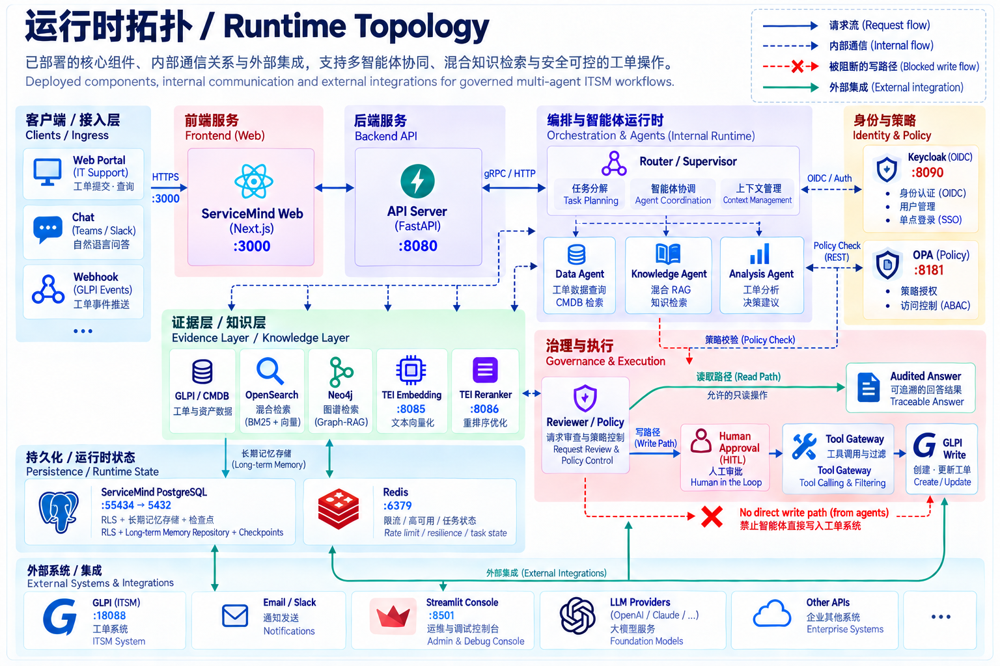
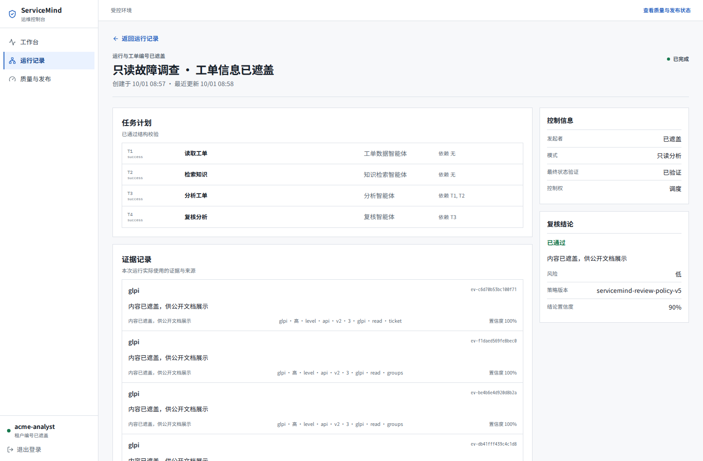

# ⚙️ ServiceMind

> **English version: [README.md](README.md)。**

ServiceMind 把一张 GLPI 工单转化为一次**按租户隔离、可审计、由人工把关的 ITSM 运行**。它解决的是「LLM 可以给建议」与「企业 ITSM 必须说明证据、遵守权限边界、写入生产工单前必须获批」之间的落差。

[快速开始](#快速开始) · [架构](#架构) · [Evaluation 摘要](#evaluation-摘要) · [使用案例](#使用案例)

## 完整业务流

下面每一阶段都跑在同一个租户边界内。读取在出口处过滤，写入在人工裁决之前一律拒绝。



读取由 OIDC claims、检索 ACL 与 PostgreSQL 行级安全共同约束;写操作绑定已评审的 `ActionIntent`,完成后再从 GLPI 回读验证。

## 核心能力

| 能力 | 提供的价值 |
| --- | --- |
| **受治理的多智能体编排** | LangGraph Router/Supervisor 将数据、知识、分析、评审与动作任务编排为有界 DAG。 |
| **企业级证据检索** | OpenSearch 混合检索、重排与引用，外加可选 Neo4j Graph-RAG；全程执行租户、实体、组 ACL。 |
| **人工控制的变更执行** | 不可变 action hash、Reviewer 门禁、HITL 审批、幂等、回读验证与 append-only 审计。 |
| **模型与工具治理** | Provider/model 白名单、成本与超时上限、语义缓存、契约校验的 Tool Gateway、OPA 与 MCP 边界。 |
| **运维控制台** | 受 OIDC 保护的 Next.js 与 Streamlit 界面，覆盖运行、审批、审计、记忆复核与质量可见性。 |

## Evaluation 摘要

评测记录是版本化证据。当前交付结论与已知限制见[最终交付报告](docs/SERVICEMIND_FINAL_DELIVERABLE_REPORT_2026-10-03.md)。各项 live evaluation 均在**各自批次内**检查并绑定单一部署版本；不同批次不宣称来自同一个 source revision。

| 领域 | 已记录结果 |
| --- | --- |
| 响应质量（冻结案例集） | 可答案例 **119/120（99.17%）** 通过 Reviewer 决策口径门禁；80 条负向对照案例全部通过。它不是答案事实正确率或生产业务成功率。 |
| 安全与故障处理 | **72 个场景通过**；252 条证据断言与 87 条变异断言通过 |
| 可靠性 | 8 个案例 × 5 次重复中，运行状态和评审决策稳定；引用输出仍有波动（`0.875`） |
| 负载 | **尚未验收**：门禁被确定性案例 `Q-002` 阻断，延迟本身未退化 |
| RAG 检索质量 | **未认证**：现有 benchmark 同时受 gold-label 缺陷、代理语料失配及 metric/cutoff 口径问题影响，因此不发布 Recall/MRR/NDCG 性能结论；诊断中仍有 4 条真实检索漏失。 |
| Memory | 治理契约通过；尚未采样生产业务质量 |

[18 项覆盖度审计](docs/EVALUATION_18_COVERAGE_AUDIT_2026-10-02.md)保留了未通过门禁在内的完整证据；[`evaluation/README.md`](evaluation/README.md)说明这些数据的目录与保留规则。`evaluation/` 中的历史材料是可追溯结论的输入，而非临时垃圾。

## 架构

ServiceMind 是分层的：接入、身份、编排、证据、治理与执行、存储与集成共用同一个租户边界。**读路径**与**写路径**分离：读取经权限过滤，写入须先由人工裁决冻结的 `ActionIntent`，两条路径都记录到 append-only 审计账本。



图中的接入渠道和 GLPI 动作范围含概念性示意：本仓库实际提供 GLPI/Webhook/API/控制台接入，以及须审批的**工单跟进写入**；Email、Teams/Slack 接入和通用工单创建、更新、解决动作尚未实现，不应当作已交付能力。

### 租户与权限模型

权限进入系统只有一处来源 —— OIDC token claims —— 并在四个相互独立的位置被执行，而不是在链路下游被"信任"。

| 执行点 | 判定规则 |
| --- | --- |
| PostgreSQL 行级安全 | 所有产品表都在 `set_config` 钉死的租户会话下读写。 |
| 检索 ACL | 未声明实体/组限制的文档（及投影后的图节点）在租户内可见；一旦声明了限制，就要求与主体有交集。 |
| 记忆 ACL | 记录声明的 `required_entity_ids` / `required_group_ids` 必须是主体集合的**子集**，因此主体越窄看到的记录严格越少，绝不会更多。 |
| 工具注册表 | 角色交集是**必需**的；带实体范围的工具还额外要求实体交集。 |

图侧通道不享有豁免：投影出的 `GraphNode` 携带同一套 ACL 坐标，并委托给同一条规则，所以这条边界只写一次，不会在文档路径和图路径之间漂移。



长期记忆记录与复核队列由 PostgreSQL 持久化。图中的策略片段仅是示意：PostgreSQL RLS
负责租户边界，角色检查由服务层执行，检索与记忆还分别检查实体/组 ACL；以表中的规则和实际代码为准。

### 运行生命周期

一次运行是一台持久状态机，不是一个请求。下面的状态就是 `GET /v1/servicemind/runs/{id}` 会返回的那些。



有两条性质值得从这张图里读出来。**拒绝会终结这次运行**：裁决被记录后运行会回到 `running`，但那只是为了把图收尾，它最终以 `cancelled` 结束且不执行任何动作 —— 所以"拒绝"永远不会因为缺少某条审批路径而被挡住。而 `waiting_approval` 是一个**暂停**，不是队列：运行停在那里时没有任何内容流到 GLPI，且裁决绑定的是已冻结的 `ActionIntent` 哈希，而不是它后来变成了什么。

## 仓库结构

产品与脚手架同处一个 `src/` 树。**产品**代码自包含于 `src/servicemind/`,由 `src/service/service.py` 挂到服务上。

```text
src/
├── servicemind/        # 已打包的模块化产品
│   ├── foundation/     # 与框架无关、跨上下文共享的原语
│   ├── domain/         # 纯业务契约与完整性原语
│   ├── orchestration/  # 持久工作流、规划、恢复与治理
│   ├── interfaces/http/# HTTP 入站适配器
│   ├── persistence/    # 数据库与事务 outbox 适配器
│   └── rag|memory|context|model_gateway|tool_platform|…
├── service/            # FastAPI 组合根(`create_app`)
├── agents/             # 继承自上游的 LangGraph agents(chatbot、research-assistant、…)
├── core/               # 配置 + 模型查找(共享)
├── schema/             # 协议 + 模型名 schema
├── client/             # AgentClient(可基于 agent 服务构建其它应用)
├── voice/              # 聊天界面 STT/TTS providers
├── pages/              # 随发行包交付的 Streamlit 审核页面
├── streamlit_app.py    # ServiceMind Console(聊天界面)
└── run_service.py      # 入口: uvicorn "service:app"
migrations/             # Alembic 迁移 0001–0013(产品 schema,Postgres)
deploy/glpi/            # 本地 GLPI + MariaDB + Postgres + Keycloak + OpenSearch +
                        #   Neo4j + TEI embedding/reranker + Redis + OPA 栈(docker compose)
evaluation/             # Gold 集、检索/路由/验收评测 harness 与报告
skills/                 # 可为 agent 装配的版本化技能
docker/                 # Dockerfiles(service/app)、附加 compose 文件
docs/                   # 各阶段验收文档 + 企业级主规格
scripts/                # 各阶段 seed/verify/ingest/evaluate 脚本
deploy/systemd/         # 版本化 API / 前端 / Streamlit / outbox 进程清单
frontend/               # Next.js 16 运维控制台（OIDC、租户范围 API 视图）
```

服务启动链路(`src/service/service.py` → `src/run_service.py`)与根级 `compose.yaml`
仍依赖继承自上游的脚手架层(`src/agents|core|memory|schema|client|voice` 与
`streamlit_app.py`),因此这些层是**承重**的运行时基础设施,不是"产品代码"——请勿当作
死代码删除。

`pyproject.toml` 已声明构建后端、显式包发现以及安装后的 `servicemind-api` /
`servicemind-outbox` 入口。[`scripts/audit_project_structure.py`](scripts/audit_project_structure.py)
是可执行的架构契约,由 CI 的 `architecture-gate` job 执行:它会拒绝包依赖环、领域层向外依赖、
源码路径注入、不完整的进程清单,以及产品对上游脚手架 import 的**任何增长**。脚手架预算是
冻结的技术债——`core` 26 处 import 站点、`schema` 1 处——只允许减少。当已提交的报告与代码树
不再一致时门禁同样失败,因此证据不会与其描述的对象脱节。机器可读结果见
`evaluation/reports/project_structure_latest.{json,md}`。详见
[`docs/PROJECT_STRUCTURE_ENTERPRISE_AUDIT_2026-09-22.md`](docs/PROJECT_STRUCTURE_ENTERPRISE_AUDIT_2026-09-22.md)。

## 运行时拓扑

一条 GLPI 工单事件(或一次 `runs` 请求)进入 **service 壳**;ServiceMind **编排运行时**
把该运行规划为多步 LangGraph 图。检索层为规划器供料:**混合 RAG**(OpenSearch + 重排,
租户 RLS + ACL 过滤)与 **Graph-RAG**(Neo4j,可选)。写操作仅在审批人解决待决 action 后
才回写 **GLPI**。每一步都在 `set_config` 钉死的租户会话下事务于 **Postgres**,写入
**append-only 审计**;模型调用一律经由**模型网关**(白名单、成本上限、审计)。详见
[`docs/PHASE5_FINAL_ARCHITECTURE_AND_ACCEPTANCE.md`](docs/PHASE5_FINAL_ARCHITECTURE_AND_ACCEPTANCE.md)
与 [`docs/企业IT服务管理(ITSM)智能体平台.md`](docs/企业IT服务管理(ITSM)智能体平台.md)。



图中端口是本地栈默认值；[本机 systemd 部署](LOCAL_DEPLOYMENT.md)的 API
监听 `127.0.0.1:18080`，不是 `:8080`。OpenSearch、Neo4j 与 TEI 需启用 Compose 的
`rag` profile。图中的 Teams/Slack 接入和通用 GLPI 创建/更新标签属于概念示意，
并非已交付功能：当前实现的入口为 GLPI Webhook/API/控制台，受治理的写操作是审批后的
工单跟进写入。

## 快速开始

### 前置条件

- Python ≥ 3.12、< 3.15,以及 [uv](https://docs.astral.sh/uv/)(CI 与 Dockerfile 均固定 uv
  版本;见 [DEPENDENCIES.md](DEPENDENCIES.md))。
- `.env` 中至少一个 LLM provider key(ServiceMind 默认 DeepSeek;toolkit 的
  OpenAI/Anthropic 等 provider 仍可用)。`USE_FAKE_MODEL=true` 可去掉该要求,用于零外部依赖演示。

### A. Docker Compose 核心服务栈

根级 [compose.yaml](compose.yaml) 启动 Postgres、agent 服务与 Streamlit 应用:

```sh
cp .env.example .env        # 然后填入 provider key 与 SERVICEMIND_DATABASE_URL
docker compose watch        # 或: docker compose up --build
```

- ServiceMind Console:<http://localhost:8501>
- Agent 服务 + OpenAPI 文档:<http://localhost:8080/redoc>

### B. 企业级 GLPI 栈(使用 ITSM 功能推荐)

ServiceMind API 需要 Postgres 16;完整事件工作流还需要 GLPI + Keycloak + OpenSearch +
Neo4j + TEI。Phase 6 工具平台另外需要 Redis(限流、舱壁、熔断与任务状态),以及可选的
OPA(外部策略决策)。`deploy/glpi/compose.yaml` 定义这些基础设施依赖；OpenSearch、Neo4j
与 TEI 需启用其中的 `rag` profile。它**不包含** ServiceMind API 与运维控制台；
依赖就绪后需分别启动。命令与端口见
[deploy/glpi/README.md](deploy/glpi/README.md)。

### C. 免 Docker 手动运行

```sh
uv sync --frozen

# .env: 填 provider key + SERVICEMIND_DATABASE_URL(建议 Postgres)。
# 仅做无 LLM key、无基础设施的界面演示:
#   USE_FAKE_MODEL=true
#   SERVICEMIND_DATABASE_URL=sqlite+aiosqlite:///./servicemind.db
cp .env.example .env

# 使用 PostgreSQL 运行 ITSM 端点时创建/扩展产品 schema；
# SQLite 仅启动 UI 壳的演示跳过此步：
uv run alembic upgrade head

# 终端 1 —— agent 服务
uv run servicemind-api

# 终端 2 —— ServiceMind Console
uv run streamlit run src/streamlit_app.py
```

### D. 运维控制台(Next.js 16)

`frontend/` 是面向运维人员的控制台(工作台 / 运行记录 / 审批中心 / 记忆复核 / 审计记录 /
质量与发布)。它通过 Keycloak OIDC 登录,每个请求都带用户令牌;租户、角色、实体、组、
审批、记忆策略与精确快照的判定始终以后端为准。控制台**没有直连 GLPI 的写路径**,只能发起
受治理的运行、并对已冻结的动作做裁决。

```sh
cd frontend
docker build -t servicemind-frontend:local .
systemctl --user enable --now servicemind-frontend.service   # 单元见 deploy/systemd/
```

默认监听 <http://127.0.0.1:3000>。运行时要求 Node.js 24;开发与门禁命令见
[frontend/README.md](frontend/README.md)。

## 使用案例

控制台按角色裁剪左侧导航。**导航栏只是可见性提示,真正的裁决点在服务端的 `require_role`
依赖里** —— 即使有人手动构造请求,越权调用仍会被 403 拒绝。

| 账号 | 角色 | 可见导航 |
| --- | --- | --- |
| `acme-analyst` | `viewer`、`analyst` | 工作台、运行记录、质量与发布 |
| `acme-approver` | `viewer`、`analyst`、`operator`、`approver` | 全部(另含审批中心、记忆复核、审计记录) |



截图取自 `acme-analyst` 登录后的真实只读运行。截图前已在浏览器中遮盖工单、租户标识与证据正文，并隐藏非必要面板，使任务计划、证据引用与评审结论同处一帧；页面没有批准操作。

> **数据前提 —— 请先读这一条。** `POST /v1/servicemind/runs` 要求 `ticket_id ≥ 1`,且每次
> 运行的第一个任务都是 `get_ticket`。**如果 GLPI 中不存在被引用的工单**,GLPI 会返回 404,
> 工具网关把它记为 `provider_not_found`(映射见
> [src/servicemind/tool_platform/gateway.py](src/servicemind/tool_platform/gateway.py)),
> T1 失败后 Supervisor 重规划两次仍无法推进,运行最终以 `waiting_review` 升级人工。
> 这不是产品缺陷,是缺数据:发起运行前请先在 GLPI 里建好对应的工单。
>
> 想一步拿到可用语料,可先灌入演示工单(幂等 —— 绝不改写已存在工单的字段,只补写缺失的
> 跟进时间线):
>
> ```bash
> uv run python scripts/seed_demo_glpi_tickets.py            # 加 --dry-run 可先预览
> ```
>
> 脚本通过与产品相同的租户集成写入 23 张工单,实体与档案和生产完全一致。本地实测:首次运行
> 报 `已创建: 8 条；已存在跳过: 15 条` 并补写若干时间线,再次运行报
> `已创建: 0 条；已存在跳过: 23 条`。
>
> **语料下的实际运行结果**(实测,非预测):工单记录与跟进时间线足以支撑分析时,运行以
> `succeeded` 结束且 `review.decision = passed`;被政策判定为重大优先级的工单(如
> urgency 5 / impact 4 → 优先级 5)以 `waiting_review` 结束,原因码 `HUMAN_REVIEW_REQUIRED`
> —— 确定性门禁在语义判官被调用之前就拦下了它;而要求一个证据无法支撑的根因时,运行同样
> `passed`,但把缺口写进 `unresolved_questions` 而不是编造一个假设。带写标记发起的运行以
> `waiting_approval` 停在冻结的 `action_intent` 上,在审批人裁决之前没有任何内容写入 GLPI。

### 案例 1 —— 只读故障调查(analyst)

1. 打开 <http://127.0.0.1:3000>,点「使用企业身份登录」,在 Keycloak 页面用 `acme-analyst` 登录。
2. 工作台左侧「向运维智能体提问」:问题填「这台笔记本连不上公司 VPN,帮我定位原因」,
   「关联 GLPI 工单」填一个**真实存在**的工单号,**不勾**「允许生成写操作建议」,
   点「发送给智能体」(或按 Ctrl / ⌘ + Enter)。
3. 浏览器跳转到 `/runs/{id}`。运行详情里能看到 Supervisor 的任务 DAG:
   T1 `get_ticket`(取工单上下文)、T2 `knowledge`(RAG / Graph-RAG 检索)、
   T3 `analysis`、T4 `reviewer`,以及每一步的证据引用与评审结论。
4. `acme-analyst` 是只读角色,**看不到批准按钮是预期行为**。

### 案例 2 —— 写操作建议 + 人工审批(analyst 发起 / approver 批准)

1. 用 `acme-analyst` 发起,这次**勾选**「允许生成写操作建议」。
2. 运行通过策略校验后会冻结一个 `action_intent`,其中包含动作类型、目标、参数、风险等级、
   动作哈希、意图版本、策略版本、复核摘要、证据摘要、证据引用、过期时间等,状态进入
   `waiting_approval`。
3. 换 `acme-approver` 登录,进左侧「审批中心」,核对冻结意图与所依据的证据,再批准或拒绝。
4. **批准和拒绝都会写入 `audit_events`** 这本治理账本,可在「审计记录」页追溯。

### 案例 3 —— 复核升级的处理

当前置任务失败、评审要求重规划而重规划次数已用尽时,运行会以 `waiting_review` 结束,并在
时间线里写明升级理由(例如「T1 两次失败,上下文未建立,无法安全推进分析」)。
`acme-approver` 可在运行详情中用 review-resolution 处置这条升级。

### 案例 4 —— 长期记忆复核(approver)

进入「记忆复核」查看被隔离的长期记忆快照,逐条激活或拒绝。裁决作用于**精确快照**
(带版本与内容摘要),不是模糊匹配 —— 这样复核过的内容不会被后续写入悄悄替换。

### 案例 5 —— 审计追溯

「审计记录」是一本**只读、追加写**的治理账本,与运行时间线**是两本不同的账**:

- `run_events`(运行时间线)—— 记录运行内部发生的事:路由、计划、派发、Agent 完成、升级。
- `audit_events`(治理审计账本)—— 记录治理动作:创建运行、批准、取消等。

可见角色为 `operator` / `approver` / `tenant_admin`。

### 案例 6 —— 质量与发布

「质量与发布」渲染仓库中已验收的机器报告快照(`frontend/public/release-status.json`)。
它是一份**冻结、脱敏**的制品,不声称实时遥测;在租户领域证据补齐之前,它会持续显示
「领域质量尚未认证」这条例外。

## 配置

全部通过 [`.env.example`](.env.example) 的环境变量驱动。主要分组:

- **模型 providers** —— `DEEPSEEK_API_KEY`(默认 provider),以及 toolkit 的
  OpenAI/Anthropic/Google/Groq/AWS/Ollama/OpenRouter/compatible keys。
- **运行时** —— `HOST`、`PORT`、`AUTH_SECRET`(HTTP bearer)、`MODE=dev`(uvicorn reload)、
  脚手架 checkpoint 的 `DATABASE_TYPE`/`POSTGRES_*`。
- **ServiceMind 数据库** —— `SERVICEMIND_DATABASE_URL`(运行时,RLS 租户隔离)与
  `SERVICEMIND_MIGRATION_DATABASE_URL`(alembic)。ITSM 端点需要 Postgres 16;sqlite 仅用于
  UI 演示时启动壳。
- **GLPI** —— `GLPI_BASE_URL`、`GLPI_API_VERSION`、凭据、entity/profile 默认值。
- **Phase 4 RAG / Graph-RAG** —— OpenSearch URL + 凭据、embedding/reranker 模型与钉死
  revision、TEI 端点、RAG 特性开关、Neo4j URI/凭据。
- **Phase 5 治理** —— `SERVICEMIND_{MEMORY,CONTEXT,SKILLS,MODEL_GATEWAY_AUDIT,
  SEMANTIC_CACHE}_ENABLED` 特性开关、模型白名单、成本/超时上限。

特性开关默认关闭;在目标环境启用前请先阅读 Phase 4/5 文档。

## HTTP API 速查

| 端点 | 用途 |
| --- | --- |
| `GET /health`、`GET /info` | 存活探针;可用 agents/models |
| `POST /{agent_id}/invoke`、`/stream` | 通用 toolkit agents(继承) |
| `GET/POST /threads`、`POST /history`、`POST /feedback` | 会话状态 + 反馈 |
| `POST /v1/servicemind/runs` | 启动受治理的 GLPI 工单运行(角色 `analyst`) |
| `GET /v1/servicemind/runs/{id}` | 运行状态 + 待决 action intent |
| `POST /v1/servicemind/runs/{id}/approval` | 批准/拒绝写操作(角色 `approver`) |
| `POST /v1/servicemind/runs/{id}/review-resolution` | 解决复核升级 |
| `GET /v1/servicemind/memories/review-queue` | 列出/筛选 ACL 范围内的隔离记忆（`approver`） |
| `POST /v1/servicemind/memories/{id}/review` | 激活/拒绝精确绑定的记忆快照（`approver`） |
| `POST /v1/servicemind/runs/{id}:cancel` | 取消 pending/awaiting 运行 |
| `GET /v1/servicemind/runs/{id}/events` | 运行事件 SSE 流 |
| `POST /v1/servicemind/webhooks/glpi` | 接入签名 GLPI webhook(幂等) |
| `GET /v1/servicemind/glpi/health` | GLPI 连通性/租户探针 |
| AG-UI 端点 | 连接任意 AG-UI 兼容前端 |

## 测试与 CI

测试套件是契约,提交前保持绿色:

```sh
uv run ruff format --check .
uv run ruff check .
uv run pyrefly check
uv run python scripts/audit_project_structure.py --check   # 架构契约
uv run pytest                                   # 全量离线套件
uv run pytest tests/integration --run-docker    # docker 门控集成
```

架构契约会把代码树与已提交的报告比对,因此**有意**改动结构后需先重新生成报告——`uv run
python scripts/audit_project_structure.py`(不带 `--check`)——再与代码一并提交。

`.github/workflows/test.yml` 运行 ruff、pyrefly、pytest(Python 3.12/3.13/3.14)、Markdown
lint、架构门禁以及 docker 集成 job。提交/撰写约定见 [CLAUDE.md](CLAUDE.md)。

前端 job 用 `npm ci` 安装,跑 `npm run check`(lint、类型检查、单测、生产构建)与一道依赖门禁。
这道门禁落在 [`frontend/scripts/audit-gate.mjs`](frontend/scripts/audit-gate.mjs),而不是裸的
`npm audit --audit-level=high` —— 因为 lint 工具链里有一条通告**上游没有修复版本**(`braces`
在 npm 上的最新版就是受影响的那个版本)。门禁仍然审计**整棵已安装依赖树**,只豁免被点名的
那一条,且**到期自动重新生效** —— 与根目录 [`.trivyignore.yaml`](.trivyignore.yaml) 是同一份
契约:例外必须在日志里可见,并且会自己过期。

### Phase 7 验收门禁说了什么、没说什么

`uv run python scripts/check_phase7_gate_reports.py` 会**离线**把四门 Phase-7 gate 各跑一次,再
与各自已提交的报告逐门比对,一致则退出 0。这个退出码很容易被读成「验收通过」。它不是。

默认验收重放录于 2026-09-30，绑定版本为
`cf08ac8a7b731054e492ed81ba5f3164dc381863+dirty(26 files)`。修订号记录在每条重放的
`environment.deployed_revision`，不在报告的逐案例行中。另有[2026-10-03 全量验收批次](evaluation/reports/phase7_acceptance_2026-10-03.md)：
同一部署版本（`b385df7c…+patch(fbdbefc59bbc)`）下 28/28 案例、107/107 断言通过，
`--expect-revision` 对该部署的断言也通过。这份结果不能自动代表之后的源码修订。

离线 gate 的退出码表明所选回放的判定和批内版本同质性。要确认它们是否属于**指定部署版本**，
须传入 `--expect-revision <rev>`；不传时报告 `currency_checked: false`。
另外几门 live gate 也有相同的版本边界。

## 文档索引

先读这三份，它们记录了**已完成批次的评测状态与版本边界**：

- 最终交付报告(完整执行记录,中文):[`docs/SERVICEMIND_FINAL_DELIVERABLE_REPORT_2026-10-03.md`](docs/SERVICEMIND_FINAL_DELIVERABLE_REPORT_2026-10-03.md)
- 18 项评测分类的逐项判定:[`docs/EVALUATION_18_COVERAGE_AUDIT_2026-10-02.md`](docs/EVALUATION_18_COVERAGE_AUDIT_2026-10-02.md)
- Phase 7 评估收尾的历史计划(轨迹 / 协同 / 可靠性 / 语义裁判):[`docs/PHASE7_REMAINING_EVALUATION_2026-10-02.md`](docs/PHASE7_REMAINING_EVALUATION_2026-10-02.md)

参考与背景:

- 企业级主规格(中文):[`docs/企业IT服务管理(ITSM)智能体平台.md`](docs/企业IT服务管理(ITSM)智能体平台.md)
- 架构图景:[`docs/PHASE3_CURRENT_ARCHITECTURE_MAP.md`](docs/PHASE3_CURRENT_ARCHITECTURE_MAP.md)
- Phase 4 RAG 技术基线:[`docs/PHASE4_RAG_TECHNICAL_BASELINE.md`](docs/PHASE4_RAG_TECHNICAL_BASELINE.md)
- Phase 4 RAG 质量根因:[`docs/PHASE4_RAG_QUALITY_ROOT_CAUSE_2026-09-15.md`](docs/PHASE4_RAG_QUALITY_ROOT_CAUSE_2026-09-15.md)
- Phase 5 架构与验收:[`docs/PHASE5_FINAL_ARCHITECTURE_AND_ACCEPTANCE.md`](docs/PHASE5_FINAL_ARCHITECTURE_AND_ACCEPTANCE.md)
- Phase 5 记忆质量评测:[`docs/PHASE5_MEMORY_QUALITY_EVALUATION.md`](docs/PHASE5_MEMORY_QUALITY_EVALUATION.md)
- Phase 7 验收基线:[`docs/PHASE7_ACCEPTANCE_BASELINE.md`](docs/PHASE7_ACCEPTANCE_BASELINE.md)
- 各阶段验收报告:`docs/PHASE*_ACCEPTANCE.md`;实时报告见 `evaluation/reports/`
- 本地部署说明:[`LOCAL_DEPLOYMENT.md`](LOCAL_DEPLOYMENT.md)
- GLPI 栈:[`deploy/glpi/README.md`](deploy/glpi/README.md)
- 依赖与环境:[`DEPENDENCIES.md`](DEPENDENCIES.md)

`agent_architecture.png`、`agent_architecture.excalidraw` 与 `agent_diagram.png` 是**上游
toolkit 的**图，保留用于溯源与归属。它们描述的是继承来的脚手架（Streamlit 聊天前端 + LangGraph
`model`/`tools` 循环），**不是** ServiceMind 的 ITSM 流水线 —— 不要把它们当作本产品的架构图呈现。

## 上游、历史与许可

本项目衍生自 🧰 [AI Agent Service Toolkit](https://github.com/JoshuaC215/agent-service-toolkit)
(`JoshuaC215/agent-service-toolkit`,MIT),即 Joshua Carroll 及其贡献者构建的完整
LangGraph + FastAPI + Streamlit agent 服务工具箱。二者关系如实保留:

- **完整保留 git 历史** —— 本仓库不是 squash 重写。它始于上游谱系(约 255 条
  Joshua Carroll 与 toolkit 其它贡献者的提交),随后是 **Shark6438** 的 ServiceMind 提交
  (产品工作起始于 2026 年 9 月,上游基线 `fe3b2dc` 之上)。因此 GitHub 上的贡献者列表
  同时显示 ServiceMind 维护者与上游作者 —— 本仓库正是从他们的代码起步的。
- **LICENSE 与版权声明原样保留** —— [LICENSE](LICENSE) 为上游 MIT License,
  Copyright (c) 2024 Joshua Carroll;ServiceMind 的增量同样以 MIT 分发。
- **脚手架代码保持上游归属** —— 继承自 toolkit 的层(`src/agents`、`src/core`、
  `src/schema`、`src/client`、`src/voice`、`src/streamlit_app.py`、docker 文件与通用
  chat 端点)仍是其原作者的成果。`media/agent_*` 那几张图属于同一批。

ServiceMind 自身的增量(`src/servicemind` 产品树、migrations、GLPI 栈、评测 harness、
skills、ServiceMind 阶段文档)由 **Shark6438** 维护。感谢上游 toolkit 及其作者奠定的基础。

## 贡献

欢迎提交 PR。请遵循 [CLAUDE.md](CLAUDE.md) 约定,保持测试套件绿色,并在改动中保留上游
归属。
